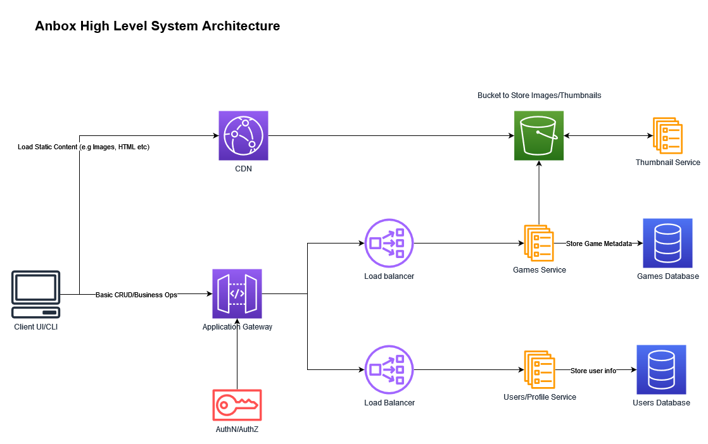
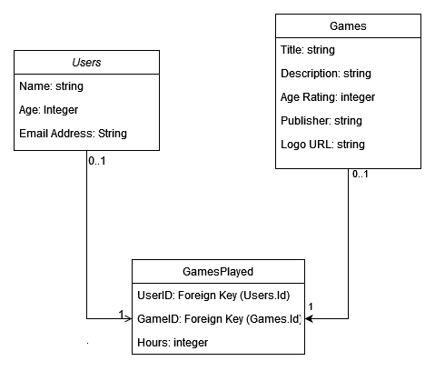
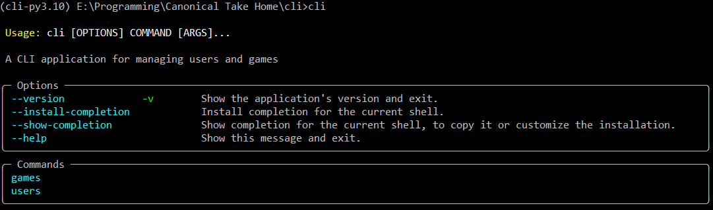
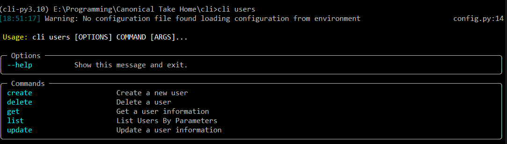
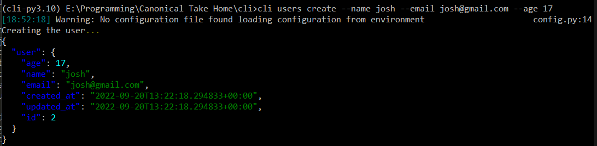
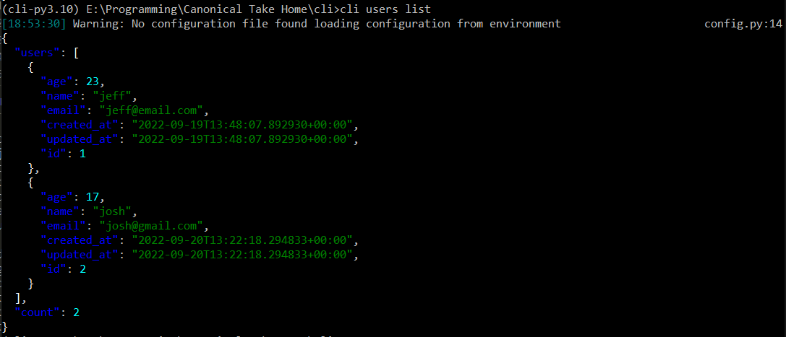

Anbox Games Service
========================

This is monorepo divided into the following parts:

    folder
    ├── api              - web api for hosting the service operations.
    ├── cli              - CLI for interacting with these APIs.
    ├── sdk              - A Python client generated from OpenAPI Spec of the server.
    └── docs             - Project related docs like architecture design, data model etc.

Architecture & Design Of System
==========================

The **proposed** architecture of how the APIs might look like in a microservice world are given in the following diagram:

- The user might interact using a CLI/GUI/API Clients etc. to the services
- The service requests are handled using the API Gateway which is used to orchestrate external business logic like authentication, composing results etc.
- The gateway can route the request to hosting service for the web APIs. Here the APIs can be divided into two services:
  - *Games API*: This api will handle the CRUD operations and any business logic along with storing the metadata stored about the games. This api will also provide the functionality to upload images for these games to an object storage which could then be served to the users
  - *Users API*: This api handles the user metadata for the users interacting with the system for e.g their personal info, hours played etc.
- Each of these services could have their own database and these services can technically split using some sort of domain segregation too.
- The object storage could also be optionally supported by a thumbnail service in order to optimize the content delivery for these static artefacts through a CDN.

Database Design
=====================

The choice of database here could be both relational or non-relational based on the scale expected for the system. Since the requirement of this data is not to be consistent and we can deal with it being updated in some time (i.e not transactional), we can easily use a NoSQL database as well for fulfilling our data needs, which could be easier to scale horizontally in the future.
As far as the features go, we will look at the data model for these features:
    - We should be able to store the `users` metadata and add/update/delete/list users
    - We should be able to store the `games` metadata and add/update/delete/list games
    - We should be able to update the playtime, or the number of hours per game for each user
    - We should be able to store the images for games as their logos

The data model is given as follows:

A couple of things to note about the data model
- We could just store the url in the database which could be supplied by the server in response which the client can then use to query through a CDN or object storage, for faster response times and lower latency.
- We can store the hours played for each user in another relation/table which can just have the IDs of games and users along with their play times.

Web API Design
=========================

We can easily model the data as CRUD models for REST resources called `games` and `users`. **They can be exported from the given api using `/docs` or `/redoc` which follows the OpenAPI spec.** So we can have the following endpoints for resources and sub resources:

- *GET /api/v1/users* : For listing the users. This could have query params like `age` etc. to filter them out.
- *GET /api/v1/games* : For listing the games. This could have query params like `publisher`, `ageRating` etc. to filter them out.

- *POST /api/v1/users* : For creating a new user. This should accept the parameters in the data model and could add and assign new attributes like `id`, `created_at`, `updated_at` etc. while storing.
- *POST /api/v1/games* : For creating a new game. This should accept the parameters in the data model and could add and assign new attributes like `id`, `created_at`, `updated_at` etc. while storing.

- *GET /api/v1/users/{id}* : For getting a specific users's stored info via `id`.
- *GET /api/v1/games/{id}* : For getting a specific game's stored info via `id`.

- *PATCH /api/v1/users/{id}* : For updating a specific users's stored info via `id`. This could take in details like age, name, email for updating them.
- *PATCH /api/v1/games/{id}* : For updating a specific game's stored info via `id`. This could take in details like ageRating, publisher, title, logo_url for updating them.

- *DELETE /api/v1/users/{id}* : For deleting a specific users's stored info via `id`.
- *DELETE /api/v1/games/{id}* : For deleting a specific game's stored info via `id`.

**NOTE**: 
The following features have not been implemented as of yet in the API, but the expected endpoints are as follows:

- *POST /api/v1/games/{id}/thumbnail*: For uploading a specific game's logo. This could accept a file of content-type multipart/form-data to upload an image to the bucket.
- *GET /api/v1/games/{id}/thumbnail*: For getting a specific game's logo.

- *POST /api/v1/users/{id}/games*: For adding playtime for a specific game to a users info. This could take in `game.id` and `hours_played`.
- *PATCH /api/v1/users/{id}/games/{id}*: For updating playtime for a specific game to a users info. This could take in `hours_played`.
- *GET /api/v1/users/{id}/games*: For listing the games played by a user along with their playtime.
- *GET /api/v1/users/{id}/games/{id}*: For getting the playtime for a specific game played by the user.

More details on how to run the API Server are given [here](api/README.md).

Application Interfaces
=========================

These web services can be access by any client which can make HTTP calls. Currently A CLI has been provided to interact with these services. Some of the screenshots of the CLI usage have been given below:

More details on the CLI itself are given [here](cli/README.md).